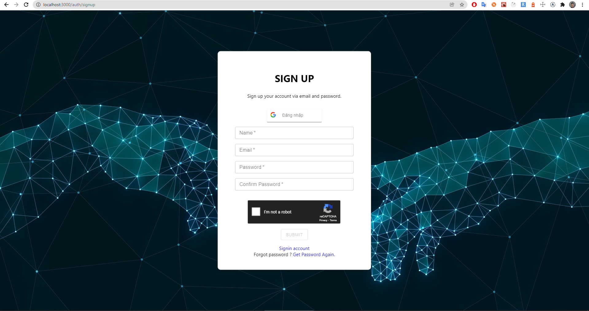
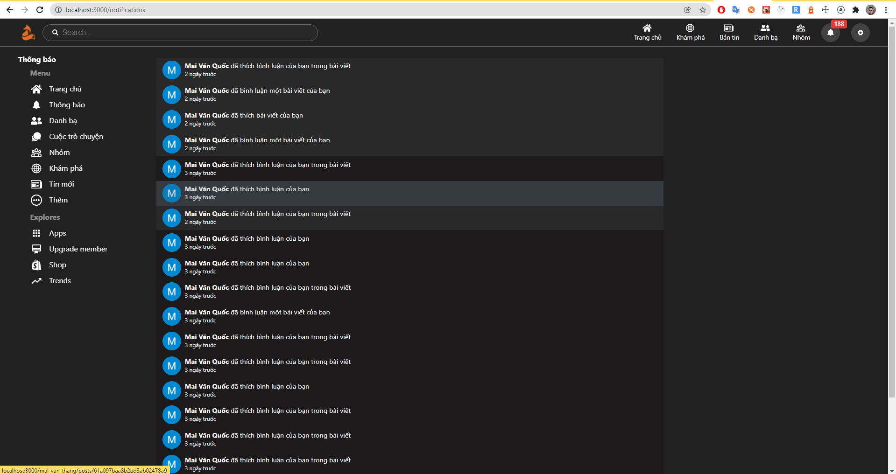

# WELCOME TO Pul.com

> 🔑 **This is an unofficial version, we are trying to improve it as soon as possible**

## The core of app

- Backend : Node.js (ExpressJS)
- Frontend : ReactJS
- Database : MongoDB
- Both using Apollo GraphQL.
- Using websocket which is available in Apollo WS and socket.io library to run real-time some required features.

## How to use

In order to use app, you need to install NodeJS version `16.*`, NPM version `7.*` and install MongoDB

1. Open folder in vscode
2. Open terminal or command line and type : **npm run install-all**
3. create file `.env`, coppy all the contents in `.env.example` to it. If you want to run mongodb from cloud, you can update mongo URI to filepath `backend/config/connectDB.js`
4. Finally, type in terminal : **npm run dev**

## Some features from app

### Signup, Signin with Password or authentication via Google.

### Logout account

### Restore Password (Unavailable)

### When signup or login successfully, we will entry home page

### Try write a status and post

### After posting a status, I comment and response at this post

### Try posting many times

### Open Notification button

### Logging another account to communicate with current account

### This new account visit current home page account, and process to make friend. Then current account accept this request

### Remove Friend

### After removing friend, both are not friends, and because of websocket, 2 accounts have remove button friends together.

### Besides, we also visite contact page to find friend, requested friend, received request friend

### Open List Friends

### Open Notifications page

